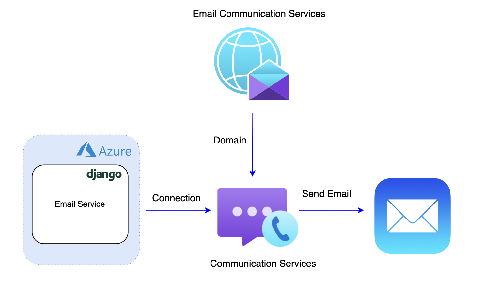
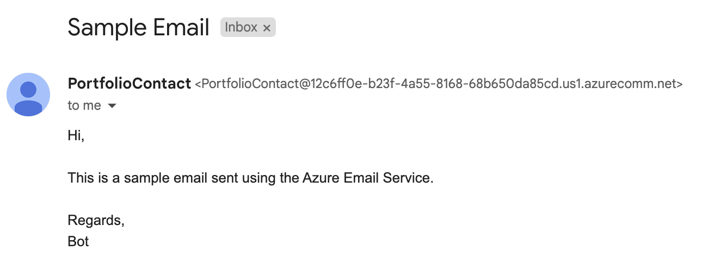

# Azure Email Service
A wrapper service created with the Azure Communication Services Python Email SDK to send Email messages. Built using Django and hosted on Azure App Services. Link to guide: https://learn.microsoft.com/en-us/azure/communication-services/quickstarts/email/send-email?pivots=programming-language-python

Below is a list of available api endpoints.

## POST
https://myazureemailservice.azurewebsites.net/api/v1/email

### POST api/v1/email
To send emails to a specified recipient. Parameters are passed in using a JSON object.

#### Parameters

|          Name | Type   | Description                                                                                                                                                           |
| -------------:|:-------:| --------------------------------------------------------------------------------------------------------------------------------------------------------------------- |
|     `subject` | string  | The subject of the Email                                                       |
|     `body` | string  | The body of the Email
|     `recipient` | string  | The recipient of the Email
|     `sender` | string  | The Azure registered Email address that will send the Email

#### Sample Email

## Future Work
- [ ] Replace connection strings with service principals for authentication.
- [ ] Implement ability to allow clients to provide authentication credentials. (Note: Currently environment variables are used at the server side)
- [ ] Add multi-recipients functionality
